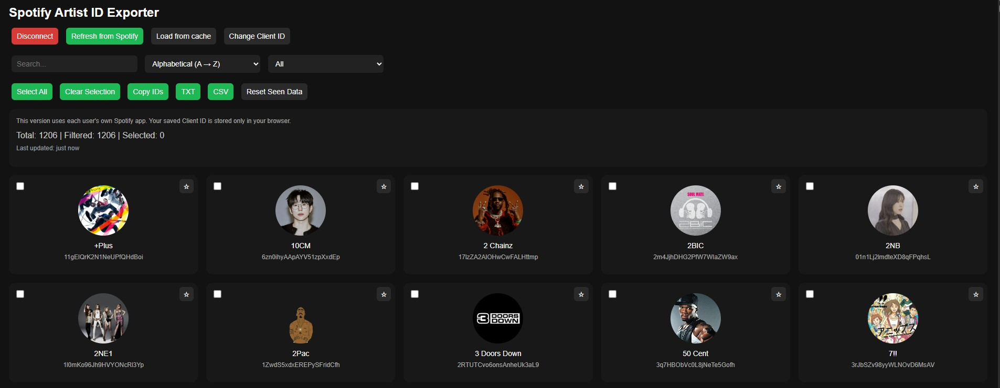

# Spotify Artist ID Exporter

Export your followed Spotify artists as IDs (TXT / CSV) using your own Spotify Developer App.

---

## 🚀 Features

* Export artist IDs as TXT or CSV
* Uses your own Spotify Developer App (no shared limits)
* "New since last visit" detection
* Favorites system
* Local cache (faster loading)
* No backend required

---

## 🛠️ How to use (Tutorial is available on the Live Demo link)

1. Open the app
2. Click the Spotify Developer Dashboard link
3. Create a new app
4. Add this Redirect URI:

```
https://spotify-artist-id-exporter.netlify.app/callback.html
```

5. Copy your Client ID
6. Paste it into the app
7. Click **Login with Spotify**

---

## ⚠️ Notes

* Your Client ID is stored locally (1 day only)
* Data is stored in your browser (localStorage)
* No data is sent to any server

---

## 🌐 Live Demo

https://spotify-artist-id-exporter.netlify.app/

---

## 📸 Preview



---

## 📄 License

MIT

---

Made for personal use, but feel free to use or modify.
